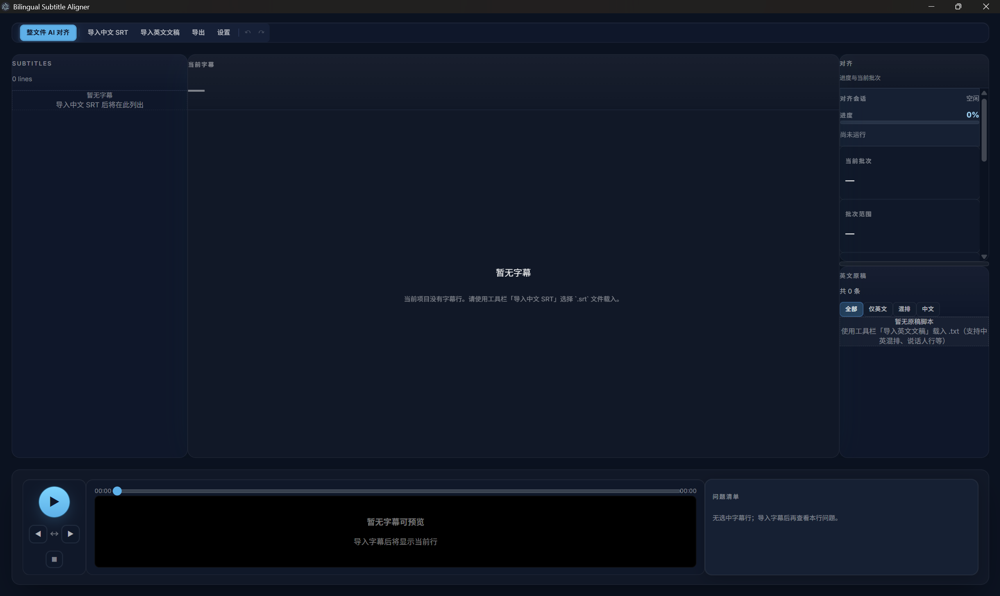

# Subtitle Workbench
~~这个程序目前没有图标绝对不是因为我懒狗没做~~
## 开源协议

本项目基于 GPL-3.0 协议开源。
## 一个面向采访、播客、长视频字幕工作流的 AI 辅助字幕对齐工具。

### 制作灵感：在给一个采访视频做完中字翻译以后觉得做英文字幕对照太麻烦了因此就萌生了做这个程序的想法

本项目极度依赖DeepseekApiKey，如需使用本项目，[请先去注册并拿到apikey](https://platform.deepseek.com/usage)

Subtitle Workbench 不追求“完全自动替换人工”，
而是强调：

- AI 生成候选结果
- Retry / Wide Retry 多轮尝试
- Review Queue 风险复查
- 人工最终确认

适用于：

- 英文采访字幕
- 播客字幕
- YouTube / B站视频字幕
- 音乐访谈
- Transcript 对齐工作流

---

## 功能特性

- AI 语义字幕对齐
- Retry / Wide Retry 工作流
- AI Attempts 多结果对比
- 全局 Review Queue
- Batch Retry 批量重试
- 非 destructive 编辑流程
- 深色工作区 UI
- 双语字幕导出
- 风险评分与低置信复查

---

## 为什么做这个工具？

传统字幕对齐工具通常只有两种：

- 全手工：效率很低
- 全自动：结果不稳定

Subtitle Workbench 的目标是：

构建一个 AI-assisted Review Workspace。

AI 负责：
- 对齐
- 切分
- 生成候选结果

用户负责：
- Review
- Compare
- Confirm

也就是说：

AI 提高效率，
人类保证最终质量。

---

## 工作流

1. 导入中文字幕（SRT）
2. 导入英文原稿 / Transcript
3. 配置 DeepSeek API Key
4. 运行 AI 对齐
5. 使用 Retry / Wide Retry 生成更多候选结果
6. 在 Review Queue 中处理高风险字幕
7. 导出双语字幕

---

## 截图

### 主工作区



### AI Attempts 与 Review Queue


### Batch Retry


---

## 下载

Windows 预览版：

[GitHub Releases](https://github.com/tiaotiaogukpg/subtitle-workbench/releases)

---

## 快速开始

### 1. 导入字幕

导入：
- 中文字幕（.srt）
- 英文原稿（.txt / transcript）

### 2. 配置 API Key

在设置中填写：
- DeepSeek API Key

### 3. 开始 AI 对齐

点击：

AI 对齐 → Review → 导出

---

## Review Workflow

Subtitle Workbench 的核心不是“全自动”。

而是：

AI-assisted review workflow。

系统会：

- 生成多个 AI Attempts
- 自动标记高风险字幕
- 支持 Retry / Wide Retry
- 提供全局 Review Queue

用户可以：

- Compare 不同 Attempt
- Apply 最佳结果
- Mark Confirmed
- 批量 Retry

---

## 技术栈

- Electron
- React
- TypeScript
- Zustand
- Vite
- DeepSeek API

---

## 后续更新~~画大饼~~（coming soooooooon的东西）

- [x] AI 语义字幕对齐
- [x] Review Queue
- [x] Batch Retry
- [x] AI Attempts Workflow
- [ ] 字幕格式 QA（CPS / 行长）
- [ ] ASS 导出
- [ ] macOS 构建

---

## 开发环境

```bash
pnpm install
pnpm dev

第一次写这种markdown文档就先这样吧